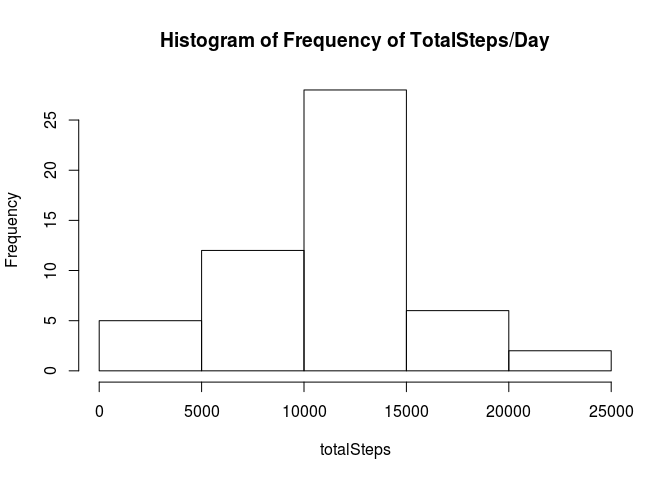
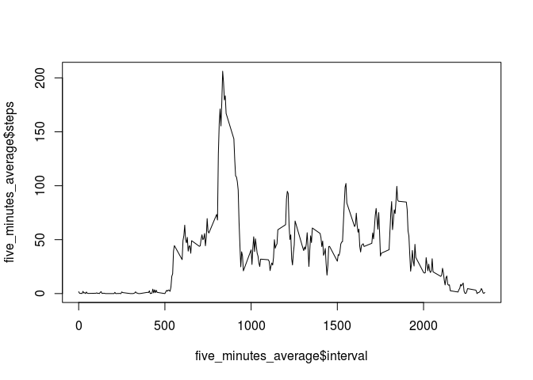
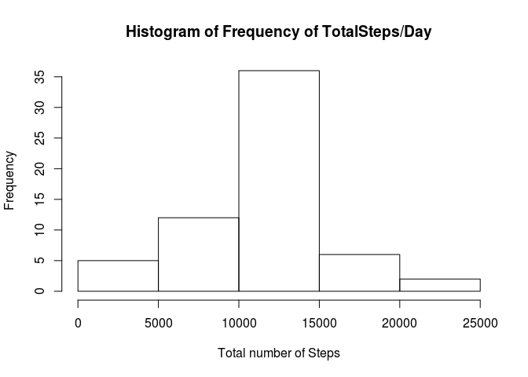
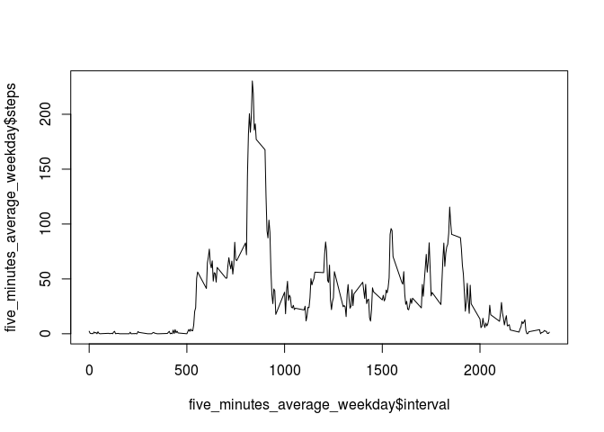
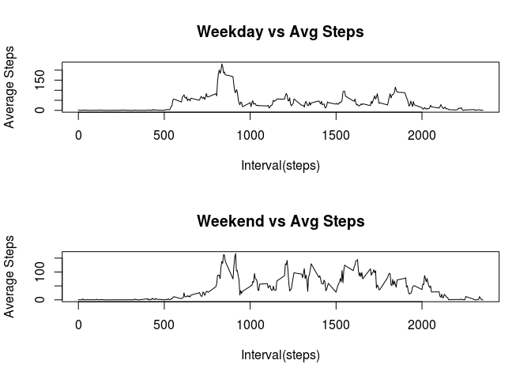

###Introduction

It is now possible to collect a large amount of data about personal movement using activity monitoring devices such as a Fitbit, Nike Fuelband, or Jawbone Up. These type of devices are part of the "quantified self" movement -- a group of enthusiasts who take measurements about themselves regularly to improve their health, to find patterns in their behavior, or because they are tech geeks. But these data remain under-utilized both because the raw data are hard to obtain and there is a lack of statistical methods and software for processing and interpreting the data.

This assignment makes use of data from a personal activity monitoring device. This device collects data at 5 minute intervals through out the day. The data consists of two months of data from an anonymous individual collected during the months of October and November, 2012 and include the number of steps taken in 5 minute intervals each day.

### Loading and preprocessing the data

####Setting the local directory and downloading the csv file

    setwd("/home/vinod/DataScience/ReproducibleResearch/RepData_PeerAssessment1/")
    fileurl<-"https://d396qusza40orc.cloudfront.net/repdata%2Fdata%2Factivity.zip"
    downloadFileName<-"activity.zip"
    fileName<-".\\Data\\activity.csv"

    if (!file.exists(fileName)) {
      download.file(fileurl, downloadFileName)
      unzip(downloadFileName, overwrite = T, exdir = "./Data")
    }
    
## What is mean total number of steps taken per day?

```r
#### Reading the data from the “activity.csv”
    activityData = read.csv('./Data/activity.csv', header = TRUE, sep = ",", na.strings = "NA")

#### Converting the “date” variable to a Date class.
    activityData$date = as.Date(activityData$date, "%Y-%m-%d")
#### Splits the data per date
    splitDay = split(activityData, activityData$date)
    
total_of_steps_per_day <- sum(activityData$steps, na.rm = TRUE)
total_of_steps_per_day
```

```
## [1] 570608
```

```r
### Total number of steps per day

    totalSteps = sapply(splitDay, function(x) sum(x$steps))
    mean(totalSteps,na.rm = TRUE)
```

```
## [1] 10766.19
```

```r
    median(totalSteps,na.rm = TRUE)
```

```
## [1] 10765
```

```r
    hist(totalSteps,main="Histogram of Frequency of TotalSteps/Day")
```

<!-- -->

```r
## What is the average daily activity pattern?

#### Make a time series plot (i.e. type = "l") of the 5-minute interval (x-axis) and the average number of steps taken, averaged across all days (y-axis)
#### creating a dataframe with the mean of each 5-minute interval and use the funtion plot() to make the time series plot

    five_minutes_average <- aggregate(steps~interval, data=activityData, FUN=mean, na.rm=TRUE)
    
    plot(x = five_minutes_average$interval, y = five_minutes_average$steps, type = "l") 
```

<!-- -->

```r
#### Which 5-minute interval, on average across all the days in the dataset, contains the maximum number of steps?
#### Using the funtion max() in order to find the maximum number of steps. And, using a for{} loop to find the 5 minute interval with maximum number of steps

    max_steps <- max(five_minutes_average$steps)
    for (i in 1:288) 
    {
        if (five_minutes_average$steps[i] == max_steps)
            five_minute_interval_at_max_steps <- five_minutes_average$interval[i]
    }
    five_minute_interval_at_max_steps 
```

```
## [1] 835
```

```r
### Imputing missing values
####Note that there are a number of days/intervals where there are missing values (coded as NA). The presence of missing days may introduce bias into some calculations or summaries of the data.

#### 1. Calculate and report the total number of missing values in the dataset (i.e. the total number of rows with NAs)
####Creating a new variable (numNa) to store the total missing values in the dataset
    ####Counts number of na values in steps
    numNa = sum(is.na(activityData$steps))
    numNa
```

```
## [1] 2304
```

```r
####Devise a strategy for filling in all of the missing values in the dataset. The strategy does not need to be sophisticated. For example, you could use the mean/median for that day, or the mean for that 5-minute interval, etc.
####The strategy will be to fill in the dataset the with the mean of that 5 minute interval
    
####Create a new dataset that is equal to the original dataset but with the missing data filled in.
####Here, I’m using a pointer in order to find the “na” Is created a new dataset (activity_filled_in), copying the original dataset After, when is finding a “na” is stored in pointer the position of ‘na’ in order to replace it with the mean value of that 5 minute interval

    
    activity_filled_in <- activityData
    for (i in 1:17568) # loop to find the na
    {
        if(is.na(activity_filled_in$steps[i])) # if steps is na store the pointer 
        { 
            five_minute_pointer <- activity_filled_in$interval[i] #store the value of pointer to find the mean on five minute interval
            for (j in 1:288)  # loop to find the value of pointer on the data frame of five minute interval
            {
                if (five_minutes_average$interval[j] == five_minute_pointer) # finding the value of mean of five minute interval data frame
                    activity_filled_in$steps[i] <- five_minutes_average$steps[j] # replacing the na by the mean in that fime minute interval 
    
            }
        }
    }
    
    
    # Splits the data per date
    splitNa = split(activity_filled_in, activity_filled_in$date)
    
    # Average steps/median
    totalNa = sapply(splitNa, function(x) sum(x$steps))
    
#### Make a histogram of the total number of steps taken each day and Calculate and report the mean and median total number of steps taken per day. Do these values differ from the estimates from the first part of the assignment? What is the impact of imputing missing data on the estimates of the total daily number of steps?

#### 4a.- Make a histogram of the total number of steps taken each day  
    # Plots histogram of the number of total steps per day
    
    hist(totalNa,main="Histogram of Frequency of TotalSteps/Day", xlab="Total number of Steps")
```

<!-- -->

```r
####4b Calculate the mean and median and explain the imoact of imputing missing data on the estimates of the total daily number of steps
    mean(totalNa)
```

```
## [1] 10766.19
```

```r
    median(totalNa)
```

```
## [1] 10766.19
```

```r
#### Due to that we use the mean value the new estimates of mean did not change

#### Due to that we use the mean value the new estimates of median change more close to the mean

## Are there differences in activity patterns between weekdays and weekends?
    
#### For this part the weekdays() function may be of some help here. Use the dataset with the filled-in missing values for this part.

### 1. Create a new factor variable in the dataset with two levels – “weekday” and “weekend” indicating whether a given date is a weekday or weekend day.
#### I used the wday() funtion

#### Using the “week_day” vector to determinate if is a weekday or weekend day and add this vector to the dataset activity_filled_in, now it is a dataset with 4 variables

    # creating a char vector (week_day) 
    week <- weekdays(activity_filled_in$date)
    week_day <- week
    
    for (i in 1:17568) # loop to find the na
    {
        if(week[i] == "Monday")
            week_day[i] <- 'weekday'
        if(week[i] == "Tuesday")
            week_day[i] <- 'weekday'
        if(week[i] == "Wednesday")
            week_day[i] <- 'weekday'
        if(week[i] == "Thursday")
            week_day[i] <- 'weekday'
        if(week[i] == "Friday")
            week_day[i] <- 'weekday'
        if(week[i] == "Saturday")
            week_day[i] <- 'weekend'
        if(week[i] == "Sunday")
            week_day[i] <- 'weekend'
    }

    # Creating a new factor variable in the dataset "activity_filled_in" 
    activity_filled_in$weekday <-week_day

### 2. Make a panel plot containing a time series plot (i.e. type = "l") of the 5-minute interval (x-axis) and the average number of steps taken, averaged across all weekday days or weekend days (y-axis).
####Were created new data frames to divide weekday and weekend days I used the plot() funtion to generate the graphics, That is why are separated

    # finding the elements by "weekday" or "weekend"
    weekday <- grep("weekday",activity_filled_in$weekday)
    weekday_frame <- activity_filled_in[weekday,]
    weekend_frame <- activity_filled_in[-weekday,]

    # What  is the average daily activity pattern?
    
    ## Make a time series plot of the 5-minute interval (x-axis) and the average number of steps taken, 
    ##    averaged across all days (yaxis)
    five_minutes_average_weekday <- aggregate(steps~interval, data=weekday_frame, FUN=mean, na.rm=TRUE)
    five_minutes_average_weekend <- aggregate(steps~interval, data=weekend_frame, FUN=mean, na.rm=TRUE)
    
    plot(x = five_minutes_average_weekday$interval, y = five_minutes_average_weekday$steps, type = "l") 
```

<!-- -->

```r
    ##The plot is setup to show the differences in the average steps vs time period between weekends and weekdays
   
        # Creates the plots
        par(mfrow=c(2,1))
        
        plot(x = five_minutes_average_weekday$interval, y = five_minutes_average_weekday$steps,xlab="Interval(steps)", ylab="Average Steps", type = "l",main ="Weekday vs Avg Steps",)
        plot(x = five_minutes_average_weekend$interval, y = five_minutes_average_weekend$steps,xlab="Interval(steps)", ylab="Average Steps", type = "l",main ="Weekend vs Avg Steps") 
```

<!-- -->
